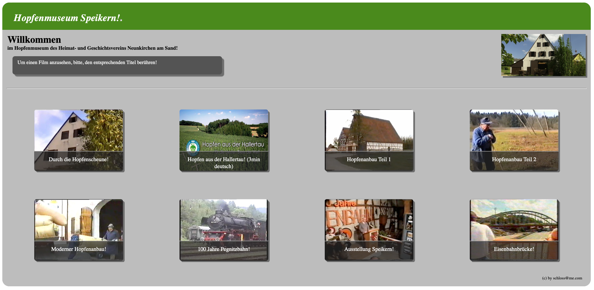
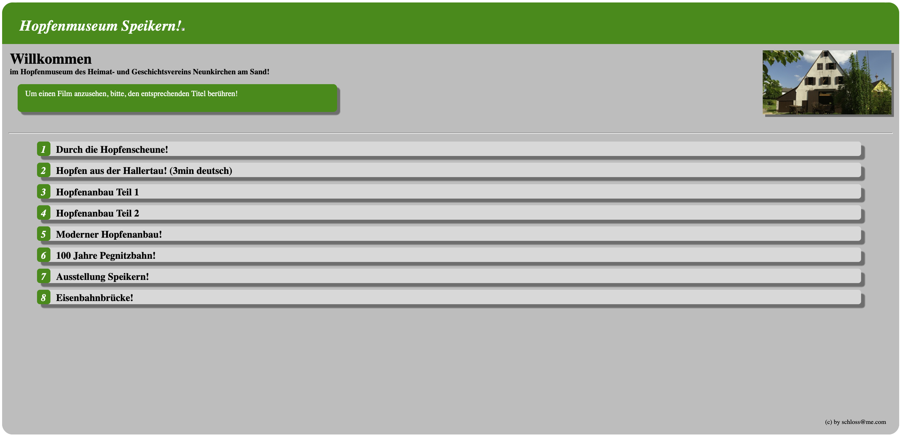
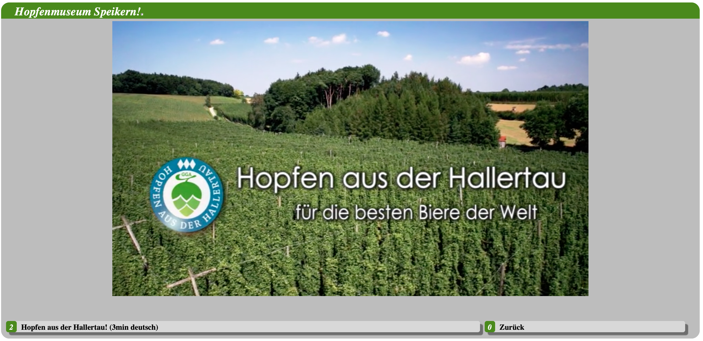
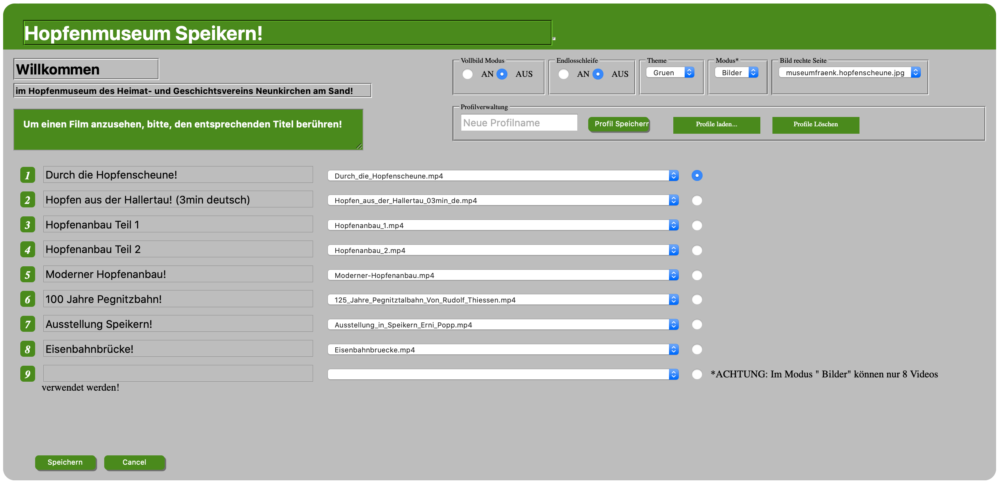

# Raspberry Pi - Museum Info Screen

## Basic concept
A web based info screen (running in kiosk mode) showing and playing a collection of videos.
Webserver and browser are run both on a Raspberry Pi using the lightweight browser and video player (kweb, omxplayer).

## Background and Motivation
The original project was created for the german Hopfenmuseum in Speikern, Bavaria.  

http://www.heimat-geschichtsverein.de/hopfenscheune.htm

The motivation was, to have a cheep but reliable **Standing Desk** for watching videos.  
Push buttons should be used for selecting them.

## Features
* Lightweight browser and media player (kweb, omxplayer)
* Touch screen friendly GUI running in kiosk mode.
* Shortkeys 0-9 for selecting videos
* External accessible for editing the settings via a web form site.
* Local editing of the page is not possible (only via external access)
* Themes for different color groups  
* Fullscreen mode (text or icon main menue)
* Loop mode

## Prerequisite
Minimum requirement is a running apache2, php5 , kweb and omxplayer  
(see: http://steinerdatenbank.de/software/kweb-1.7.9.8.tar.gz)
Apache2 has to be configured for using public_html of user pi.

### Optional
Using electric push buttons via gpio a kernel module gpio_keys can be used for mapping
keys 0-9 to the gpio ports (https://github.com/notro/fbtft_tools).

WiFi access point for external configuration access (optional)

## Installation
All files have to be copied to /home/pi/public_html.

In addition the folder /usr/local/share/kweb should be replaced with a symlink to
/home/pi/public_html/kweb .

    ln -s /home/pi/public_html/kweb /usr/local/share/

The start script should contain the following lines:

    #!/bin/sh
    bgstart_ytdl_server.sh -t=myremote &
    kweb -KJC http://127.0.0.1/~pi/index.php

## Other Examples

